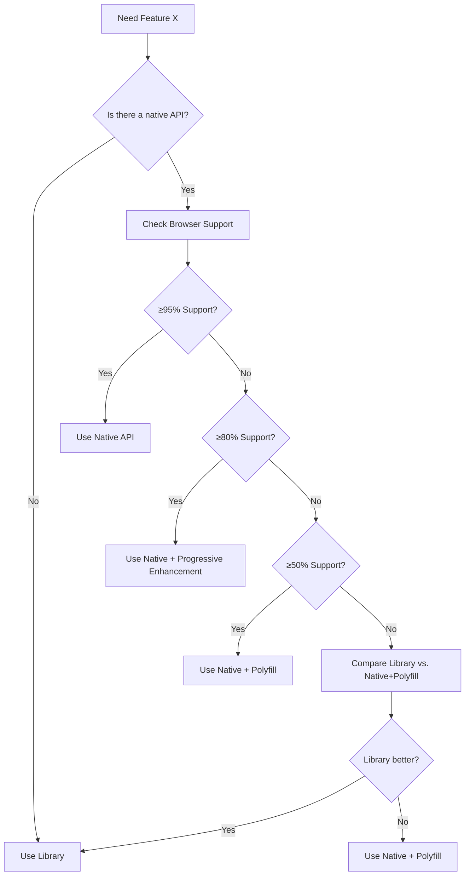

# Web Platform vs Libraries: Decision Framework

> **Skill Purpose**: Guide decisions on when to use native web platform features/APIs versus third-party libraries/frameworks.

---

## Decision Matrix

| Criteria | Native Web API | Third-Party Library |
|---|---|---|
| **Browser Support** | May require polyfills | Usually handles cross-browser |
| **Bundle Size** | Zero (built-in) | Adds KB/MB to bundle |
| **Features** | Often minimal/basic | Feature-rich, extensible |
| **Maintenance** | Browser vendors | Community/Company |
| **Learning Curve** | Low (MDN docs) | Varies (new API to learn) |
| **Customization** | Limited | Highly customizable |
| **Performance** | Optimal (native) | Usually good, can vary |
| **Accessibility** | Basic, may need manual work | Often built-in a11y |
| **Future-Proof** | Evolves with platform | May be abandoned |
| **TypeScript** | May lack types | Usually well-typed |

**Use Native API when:** ≥70% of criteria favor native
**Use Library when:** ≥70% of criteria favor library
**Evaluate further:** Mixed results

---

## Native Web APIs: Use These First

### ✅ Navigation & Routing

| Feature | Native API | Library Alternative | Recommendation |
|---|---|---|---|
| Single Page Navigation | [Navigation API](https://developer.mozilla.org/en-US/docs/Web/API/Navigation_API) | React Router, Vue Router | **Use Native** if targeting modern browsers only. SvelteKit, Next.js, Remix already use it internally. |
| Deep Linking | [History API](https://developer.mozilla.org/en-US/docs/Web/API/History) + [URL API](https://developer.mozilla.org/en-US/docs/Web/API/URL_API) | react-router, vue-router | **Use Native** for simple SPAs. Libraries add value for nested routes, lazy loading. |
| URL State | [URLSearchParams](https://developer.mozilla.org/en-US/docs/Web/API/URLSearchParams) | Query string libraries | **Always use native** - no reason for a library |

**Decision:**
- Simple SPA: Navigation API + History API
- Complex routing (nested, lazy, guards): React Router / Vue Router

---

### ✅ UI Components & Overlays

| Feature | Native API | Library Alternative | Recommendation |
|---|---|---|---|
| Modal/Dialog | [`<dialog>`](https://developer.mozilla.org/en-US/docs/Web/HTML/Element/dialog) + [Dialog API](https://developer.mozilla.org/en-US/docs/Web/API/HTMLDialogElement) | react-modal, @radix-ui/dialog | **Use Native** - excellent support, accessible, stylable |
| Popover | [Popover API](https://developer.mozilla.org/en-US/docs/Web/API/Popover_API) | tippy.js, popper.js, @radix-ui/popover | **Use Native** for simple popovers. Libraries for complex positioning/animations. |
| Tooltip | [`<tooltip>`](https://developer.mozilla.org/en-US/docs/Web/HTML/Element/tooltip) (experimental) | tippy.js, floating-ui | **Use Native** when available. Fall back to libraries. |
| Dropdown/Select | [`<select>`](https://developer.mozilla.org/en-US/docs/Web/HTML/Element/select) + [Listbox](https://open-ui.org/components/listbox) | react-select, downshift, @radix-ui/select | **Use Native** for simple. Libraries for searchable, multi-select, custom styling. |
| Dropdown Menu | [`<menu>`](https://developer.mozilla.org/en-US/docs/Web/HTML/Element/menu) + [`<details>`](https://developer.mozilla.org/en-US/docs/Web/HTML/Element/details) | @radix-ui/dropdown-menu | **Use Native** for basic. Libraries for complex submenus, keyboard nav. |
| Accordion | [`<details>`](https://developer.mozilla.org/en-US/docs/Web/HTML/Element/details) + [`<summary>`](https://developer.mozilla.org/en-US/docs/Web/HTML/Element/summary) | @radix-ui/accordion, react-accordion | **Always use native** - perfect support and semantics |
| Tabs | [ARIA Tabs Pattern](https://developer.mozilla.org/en-US/docs/Web/Accessibility/ARIA/Roles/Tab_Role) | @radix-ui/tabs, react-tabs | **Use ARIA pattern** for simple. Libraries for complex state management. |

**Decision:**
- Start with native HTML elements
- Add library only when hitting limitations (styling, behavior, a11y)

---

### ✅ Forms & Inputs

| Feature | Native API | Library Alternative | Recommendation |
|---|---|---|---|
| Form Validation | [Constraint Validation API](https://developer.mozilla.org/en-US/docs/Web/API/Constraint_Validation_API) | yup, zod, formik | **Use Native** for simple validation. Libraries for complex schemas, async validation. |
| Form State | [FormData API](https://developer.mozilla.org/en-US/docs/Web/API/FormData) | formik, react-hook-form | **Use Native** for simple forms. Libraries for complex state, arrays, dynamic fields. |
| Custom Select | [Listbox API](https://open-ui.org/components/listbox) (emerging) | react-select, downshift | **Use Native `<select>`** if styling works. Libraries for custom UI. |
| Date Picker | [`<input type="date">`](https://developer.mozilla.org/en-US/docs/Web/HTML/Element/input/date) | react-datepicker, @radix-ui/date-picker | **Use Native** for simple. Libraries for better UX, range selection, custom styling. |
| Color Picker | [`<input type="color">`](https://developer.mozilla.org/en-US/docs/Web/HTML/Element/input/color) | react-color, pickr | **Use Native** unless need advanced features |
| Range Slider | [`<input type="range">`](https://developer.mozilla.org/en-US/docs/Web/HTML/Element/input/range) | react-slider, noUiSlider | **Use Native** for simple. Libraries for dual handles, custom tracks. |
| File Upload | [`<input type="file">`](https://developer.mozilla.org/en-US/docs/Web/HTML/Element/input/file) + [File API](https://developer.mozilla.org/en-US/docs/Web/API/File_API) + [Drag and Drop](https://developer.mozilla.org/en-US/docs/Web/API/HTML_Drag_and_Drop_API) | react-dropzone, filepond | **Use Native** for basic. Libraries for previews, validation, chunking. |

**Decision:**
- Use native inputs with progressive enhancement
- Libraries justify themselves for: complex validation, dynamic forms, custom styling beyond CSS

---

### ✅ Data Fetching & State

| Feature | Native API | Library Alternative | Recommendation |
|---|---|---|---|
| HTTP Requests | [Fetch API](https://developer.mozilla.org/en-US/docs/Web/API/Fetch_API) | axios, ky, superagent | **Always use Fetch** - axios adds no real value anymore |
| Abortable Requests | [AbortController](https://developer.mozilla.org/en-US/docs/Web/API/AbortController) | axios cancel tokens | **Use Native** - cleaner API |
| Streaming | [Fetch ReadableStream](https://developer.mozilla.org/en-US/docs/Web/API/ReadableStream) | Custom implementations | **Use Native** - modern browsers |
| Server-Sent Events | [EventSource API](https://developer.mozilla.org/en-US/docs/Web/API/EventSource) | Socket.io (for SSE mode), custom | **Use Native** for simple SSE |
| WebSockets | [WebSocket API](https://developer.mozilla.org/en-US/docs/Web/API/WebSocket) | Socket.io | **Use Native** unless need fallback or rooms/namespace features |
| State Management | [Custom Elements](https://developer.mozilla.org/en-US/docs/Web/Web_Components) + [CSS Custom Properties](https://developer.mozilla.org/en-US/docs/Web/CSS/Using_CSS_custom_properties) | Redux, Zustand, Zustand | **Use Native** for component state. Libraries for global state. |
| URL State Sync | [History API](https://developer.mozilla.org/en-US/docs/Web/API/History) + [URLSearchParams](https://developer.mozilla.org/en-US/docs/Web/API/URLSearchParams) | react-router, vue-router | **Use Native** for simple. Libraries for complex sync. |

**Decision:**
- Fetch + AbortController: Always native
- Simple state: use React state / Vue refs
- Complex state: libraries provide value
- WebSockets: native unless need Socket.io features

---

### ✅ Animations

| Feature | Native API | Library Alternative | Recommendation |
|---|---|---|---|
| Simple Animations | [CSS Animations](https://developer.mozilla.org/en-US/docs/Web/CSS/CSS_Animations) + [CSS Transitions](https://developer.mozilla.org/en-US/docs/Web/CSS/CSS_Transitions) | animate.css, styled-components | **Use Native CSS** |
| Complex Animations | [Web Animations API](https://developer.mozilla.org/en-US/docs/Web/API/Web_Animations_API) | gsap, anime.js, framer-motion | **Use WAAPI** for programmatic control. Libraries for complex timelines, physics |
| Scroll Animations | [Intersection Observer](https://developer.mozilla.org/en-US/docs/Web/API/Intersection_Observer_API) + [Scroll-Driven Animations](https://developer.mozilla.org/en-US/docs/Web/CSS/CSS_Scroll-Driven_Animations) | framer-motion, AOS | **Use Native** - Scroll-Driven Animations are powerful |
| Viewport Animations | [Intersection Observer](https://developer.mozilla.org/en-US/docs/Web/API/Intersection_Observer_API) | waypoints, scrollreveal | **Always use IO** - better performance |
| Shared Element Transitions | [View Transition API](https://developer.mozilla.org/en-US/docs/Web/API/View_Transition_API) | framer-motion | **Use Native** when available - amazing UX with minimal code |

**Decision:**
- CSS for declarative animations
- WAAPI for JavaScript-controlled animations
- Libraries for complex sequencies, morphing, physics

---

### ✅ Storage & Persistence

| Feature | Native API | Library Alternative | Recommendation |
|---|---|---|---|
| Small Data | [localStorage](https://developer.mozilla.org/en-US/docs/Web/API/Window/localStorage), [sessionStorage](https://developer.mozilla.org/en-US/docs/Web/API/Window/sessionStorage) | store2, localForage | **Use Native** for <5MB |
| Structured Data | [IndexedDB](https://developer.mozilla.org/en-US/docs/Web/API/IndexedDB_API) | idb, dexie.js, localForage | **Use dexie.js** - IndexedDB API is painful |
| Cache | [Cache API](https://developer.mozilla.org/en-US/docs/Web/API/Cache) | workbox | **Use Native** for simple. Workbox for service worker caching strategies |
| Cookies | [Document.cookie](https://developer.mozilla.org/en-US/docs/Web/API/Document/cookie) | js-cookie, cookie-universal | **Use Native** - simple enough |
| Service Worker | [Service Worker API](https://developer.mozilla.org/en-US/docs/Web/API/Service_Worker_API) | workbox | **Use Native** for custom. Workbox for precaching, strategies |

**Decision:**
- localStorage/sessionStorage: Always native
- IndexedDB: Use dexie.js wrapper
- Service Worker: Native for custom, Workbox for standard patterns

---

### ✅ Media & Graphics

| Feature | Native API | Library Alternative | Recommendation |
|---|---|---|---|
| Images | [``](https://developer.mozilla.org/en-US/docs/Web/HTML/Element/img) + [ImageBitmap](https://developer.mozilla.org/en-US/docs/Web/API/ImageBitmap) | react-image, next/image | **Use Native**. next/image for Next.js optimization |
| Lazy Loading Images | [`loading="lazy"`](https://developer.mozilla.org/en-US/docs/Web/HTML/Element/img#attr-loading) | react-lazyload, lozad.js | **Use Native** - built into modern browsers |
| Responsive Images | [`<picture>`](https://developer.mozilla.org/en-US/docs/Web/HTML/Element/picture) + [`srcset`](https://developer.mozilla.org/en-US/docs/Web/HTML/Element/img#attr-srcset) | react-responsive-picture | **Use Native** |
| Video | [`<video>`](https://developer.mozilla.org/en-US/docs/Web/HTML/Element/video) | react-player, plyr | **Use Native** for simple. Libraries for HLS, Dash, custom controls |
| Audio | [`<audio>`](https://developer.mozilla.org/en-US/docs/Web/HTML/Element/audio) | howler.js | **Use Native** unless need spatial audio, effects |
| Canvas 2D | [Canvas API](https://developer.mozilla.org/en-US/docs/Web/API/Canvas_API) | fabric.js, konva.js, p5.js | **Use Native** for simple. Libraries for complex interactivity |
| WebGL | [WebGL API](https://developer.mozilla.org/en-US/docs/Web/API/WebGL_API) | three.js, babylon.js | **Use three.js** - WebGL is too low-level for most use cases |
| SVG | [SVG](https://developer.mozilla.org/en-US/docs/Web/SVG) | snap.svg, d3.js | **Use Native SVG** for static. Libraries for complex manipulation |

**Decision:**
- Native for simple media display
- Libraries for complex features (HLS video, WebGL, canvas interactivity)

---

### ✅ Device & Sensors

| Feature | Native API | Library Alternative | Recommendation |
|---|---|---|---|
| Geolocation | [Geolocation API](https://developer.mozilla.org/en-US/docs/Web/API/Geolocation_API) | Custom wrappers | **Use Native** |
| Device Orientation | [DeviceOrientation API](https://developer.mozilla.org/en-US/docs/Web/API/DeviceOrientationEvent) | Custom | **Use Native** |
| Battery Status | [Battery Status API](https://developer.mozilla.org/en-US/docs/Web/API/Battery_Status_API) | Custom | **Use Native** (note: deprecated in some browsers) |
| Network Status | [Network Information API](https://developer.mozilla.org/en-US/docs/Web/API/Network_Information_API) + [Online/Offline Events](https://developer.mozilla.org/en-US/docs/Web/API/NavigatorOnLine/onLine) | workbox-window | **Use Native** |
| Clipboard | [Clipboard API](https://developer.mozilla.org/en-US/docs/Web/API/Clipboard_API) | clipboard.js, copy-to-clipboard | **Use Native** - modern browsers |
| Fullscreen | [Fullscreen API](https://developer.mozilla.org/en-US/docs/Web/API/Fullscreen_API) | screenfull.js | **Use Native** |
| Vibration | [Vibration API](https://developer.mozilla.org/en-US/docs/Web/API/Vibration_API) | Custom | **Use Native** |
| File System Access | [File System Access API](https://developer.mozilla.org/en-US/docs/Web/API/File_System_Access_API) | Custom | **Use Native** - powerful for file editing |
| Drag and Drop | [Drag and Drop API](https://developer.mozilla.org/en-US/docs/Web/API/HTML_Drag_and_Drop_API) | react-dnd, dnd-kit | **Use Native** for simple. Libraries for complex scenarios |

**Decision:**
- Native APIs are sufficient for most device interactions
- Libraries rarely needed in this category

---

### ✅ Performance & Optimization

| Feature | Native API | Library Alternative | Recommendation |
|---|---|---|---|
| Lazy Loading | [``](https://developer.mozilla.org/en-US/docs/Web/HTML/Element/img#attr-loading) | react-lazyload | **Use Native** |
| Dynamic Imports | [Dynamic `import()`](https://developer.mozilla.org/en-US/docs/Web/JavaScript/Reference/Operators/import) | Custom | **Use Native** |
| Code Splitting | [Dynamic `import()`](https://developer.mozilla.org/en-US/docs/Web/JavaScript/Reference/Operators/import) | react-loadable | **Use Native** |
| Prefetch | [`<link rel="prefetch">`](https://developer.mozilla.org/en-US/docs/Web/HTML/Link_types/prefetch) | Custom | **Use Native** |
| Preload | [`<link rel="preload">`](https://developer.mozilla.org/en-US/docs/Web/HTML/Link_types/preload) | Custom | **Use Native** |
| Resize Observer | [Resize Observer API](https://developer.mozilla.org/en-US/docs/Web/API/Resize_Observer_API) | react-resize-observer | **Use Native** |
| Performance API | [Performance API](https://developer.mozilla.org/en-US/docs/Web/API/Performance_API) | Custom | **Use Native** |
| Memory API | [Performance.memory](https://developer.mozilla.org/en-US/docs/Web/API/Performance/memory) | Custom | **Use Native** (Chrome only) |

**Decision:**
- Always use native for performance optimizations
- Libraries rarely provide value here

---

## Third-Party Libraries: Worth the Weight

### ✅ Always Consider Libraries For

| Category | Why Libraries Win |
|---|---|
| **Rich Text Editing** | ContentEditable is notoriously buggy. Use [Tiptap](https://tiptap.dev/), [ProseMirror](https://prosemirror.net/), [Lexical](https://lexical.dev/), [Slate](https://www.slatejs.org/) |
| **Data Visualization** | Building charts from scratch is time-consuming. Use [Chart.js](https://www.chartjs.org/), [D3.js](https://d3js.org/) (for custom), [Observables/Plot](https://observablehq.com/plot) |
| **Complex Forms** | Form state management, validation, submission. Use [React Hook Form](https://react-hook-form.com/), [Formik](https://formik.org/) + [Zod](https://zod.dev/) |
| **Data Fetching (SSR/Framework)** | Framework-integrated solutions. Use [Next.js](https://nextjs.org/), [Remix](https://remix.run/), [SvelteKit](https://kit.svelte.dev/) built-ins, or [TanStack Query](https://tanstack.com/query/latest) |
| **Global State Management** | Complex app-wide state. Use [Zustand](https://github.com/pmndrs/zustand), [Jotai](https://jotai.org/), [Redux Toolkit](https://redux-toolkit.js.org/) |
| **Styling (CSS-in-JS)** | Component-scoped styles, theming. Use [Styled Components](https://styled-components.com/), [Emotion](https://emotion.sh/), [Tailwind CSS](https://tailwindcss.com/) (utility-first, not CSS-in-JS) |
| **Testing** | Test runners, assertions, mocking. Use [Vitest](https://vitest.dev/), [Jest](https://jestjs.io/), [Playwright](https://playwright.dev/), [Cypress](https://www.cypress.io/) |
| **Internationalization** | Translation, localization. Use [i18next](https://www.i18next.com/), [react-intl](https://formatjs.io/docs/react-intl/) |
| **Date/Time Manipulation** | Complex date operations. Use [date-fns](https://date-fns.org/), [Luxon](https://moment.github.io/luxon/), [Day.js](https://day.js.org/) |
| **WebGL/3D** | Complex 3D graphics. Use [Three.js](https://threejs.org/), [Babylon.js](https://www.babylonjs.com/), [PlayCanvas](https://playcanvas.com/) |
| **Animations (Complex)** | Advanced animations, physics. Use [GSAP](https://gsap.com/), [Framer Motion](https://www.framer.com/motion/), [Anime.js](https://animejs.com/) |
| **UI Component Libraries** | Pre-built accessible components. Use [Radix UI](https://www.radix-ui.com/), [shadcn/ui](https://ui.shadcn.com/), [Headless UI](https://headlessui.com/) |
| **Validation** | Complex schema validation. Use [Zod](https://zod.dev/), [Yup](https://github.com/jquense/yup), [Joi](https://joi.dev/) |
| **Utility Libraries** | Common utilities. Use [Lodash](https://lodash.com/) (selectively), [Ramda](https://ramdajs.com/), [date-fns](https://date-fns.org/) |

---

## Browser Support Checklist

Before adopting a native API:

```
□ Check [Can I Use](https://caniuse.com/) for global support
□ Check [MDN Browser Compatibility](https://developer.mozilla.org/en-US/docs/MDN/Writing_guidelines/Writing_style_guide/Code_style_guide/HTML#browser_compatibility) tables
□ Check if it's behind a flag in any major browser
□ Consider your target audience's browser distribution
□ Check if a polyfill exists (and its size)
□ Decide: progressive enhancement vs. polyfill vs. library
```

### Support Tiers

| Tier | Support % | Action |
|---|---|---|
| **Tier 1** | ≥95% | Use native, no polyfill needed |
| **Tier 2** | 80-94% | Use native with progressive enhancement |
| **Tier 3** | 50-79% | Use native with polyfill, or consider library |
| **Tier 4** | <50% | Avoid native, use library |

---

## Decision Workflow



---

## Progressive Enhancement Pattern

```javascript
// 1. Check if native API is available
if ('someAPI' in window) {
  // Use native API
  useNativeAPI();
} else {
  // 2. Fall back to library or polyfill
  useLibraryOrPolyfill();
}
```

Or with dynamic imports to avoid loading the library if not needed:

```javascript
async function useFeature() {
  if ('someAPI' in window) {
    return useNativeAPI();
  }
  
  // Only load library if native API not available
  const library = await import('some-library');
  return library.use();
}
```

---

## Monitoring & Updates

Native APIs evolve rapidly. Stay informed:

- [MDN Web Docs](https://developer.mozilla.org/) - Reference
- [Can I Use](https://caniuse.com/) - Browser support
- [Web Platform Tests](https://wpt.fyi/) - Implementation status
- [Chrome Platform Status](https://chromestatus.com/features) - Chrome features
- [Firefox Platform Status](https://platform-status.mozilla.org/) - Firefox features
- [WebKit Feature Status](https://webkit.org/status/) - Safari features
- [Interop 2024+](https://wpt.fyi/interop-2024) - Cross-browser priorities

**Quarterly Review:**
- Check if previously unsupported APIs now have broad support
- Evaluate if libraries can be replaced with native APIs
- Update polyfills and fallbacks

---

## Quick Reference: Native vs Library

| Use Case | Recommendation | Confidence |
|---|---|---|
| New project, simple SPA | Native Navigation API + History API | High |
| Modal dialogs | Native `<dialog>` element | High |
| Tooltips | Native `<tooltip>` (when available) | Medium |
| Form validation | Native Constraint Validation API | High |
| HTTP requests | Native Fetch API | Very High |
| Simple animations | Native CSS Animations/Transitions | High |
| Scroll-based animations | Native Scroll-Driven Animations | Medium |
| Image lazy loading | Native `loading="lazy"` | High |
| Responsive images | Native `<picture>` + `srcset` | High |
| Date picker | Native `<input type="date">` | Medium |
| Rich text editing | Library (Tiptap/ProseMirror) | Very High |
| Data visualization | Library (Chart.js/D3) | Very High |
| Complex state management | Library (Zustand/Jotai) | High |
| Global form state | Library (React Hook Form) | High |
| Internationalization | Library (i18next) | High |

---

## Anti-Patterns to Avoid

❌ **Using jQuery for DOM manipulation** - Native DOM APIs are sufficient
❌ **Using Moment.js for new projects** - Use native `Intl` APIs or date-fns/Luxon
❌ **Using Lodash for everything** - Use native array/object methods first
❌ **Using axios instead of fetch** - Fetch has feature parity now
❌ **Using a UI framework for simple projects** - Start with native HTML + CSS
❌ **Using a state management library for simple state** - React state/Vue refs are enough

---

## Summary: The Golden Rule

> **Use native web platform features by default. Only reach for a library when the native solution is insufficient for your needs.**

**Ask yourself:**
1. Is there a native API that solves this?
2. Does it have acceptable browser support for my users?
3. Does the library provide significant value beyond what's native?
4. Is the library's bundle size justified by the features it provides?
5. Will I need to maintain this code long-term, and if so, which approach has better longevity?

**Default to native. Opt-in to libraries.**
